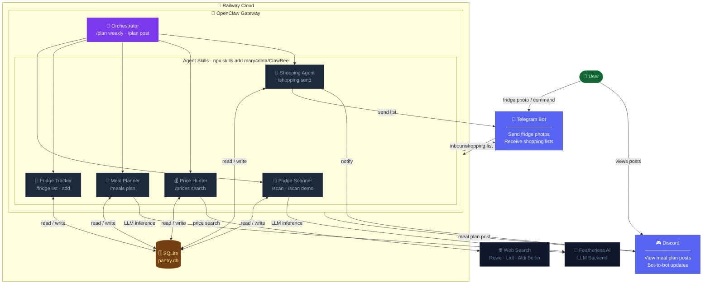

# ClawBee — Family Meal Planner Skills for OpenClaw

> Photo your fridge → get a 3-day meal plan → receive the shopping list on Telegram.

[](https://skills.sh/mary4data/ClawBee)
[](LICENSE.txt)

---

## Architecture



---

## Setup on Railway (5 min)

### Step 1 — Create a Telegram Bot

1. Open Telegram → search **@BotFather**
2. Send `/newbot` and follow the prompts
3. Copy the token: `123456789:ABCDEF...`
4. Get your Chat ID: message **@userinfobot** → copy the `Id` number

### Step 2 — Set Railway Environment Variables

In Railway → your OpenClaw service → **Variables**, add:

| Variable | Value |
|---|---|
| `TELEGRAM_BOT_TOKEN` | `123456789:ABCDEF...` |
| `TELEGRAM_CHAT_ID` | `123456789` |
| `FEATHERLESS_API_KEY` | your Featherless key |
| `DISCORD_BOT_TOKEN` | *(optional)* |
| `DISCORD_CHANNEL_ID` | *(optional)* |

### Step 3 — Run Auto-Setup

Open the Railway shell (**your service → Shell tab**) and run:

```bash
bash <(curl -s https://raw.githubusercontent.com/mary4data/ClawBee/main/deploy/setup.sh)
```

This single command:
- Writes `openclaw.json` with Telegram + Featherless AI config
- Clones ClawBee skills into `/data/workspace/clawbee/skills`
- Creates `pantry.db` with all tables
- Prints test commands when done

### Step 4 — Restart OpenClaw

In Railway → your service → **Restart** (or redeploy).

### Step 5 — Test

Send to your Telegram bot:
```
/plan help
```

---

## Install Skills Only

If OpenClaw is already configured, just install the skills:

```bash
npx skills add mary4data/ClawBee
```

Or individual skills:
```bash
npx skills add mary4data/ClawBee@orchestrator
npx skills add mary4data/ClawBee@fridge-scanner
```

---

## Commands

| Command | Description |
|---|---|
| `/plan weekly [budget]` | Full pipeline — fridge check, prices, meal plan, Telegram |
| `/plan post` | Post plan to Discord |
| `/scan` + photo | Scan fridge photo → 3-day plan |
| `/scan demo` | Demo scan (no photo needed) |
| `/scan shop` | Send scan's shopping list to Telegram |
| `/fridge list` | Show pantry contents |
| `/fridge add <item> [qty]` | Add item |
| `/meals plan [budget]` | 7-day dinner plan |
| `/prices search <item>` | Find cheapest price in Berlin |
| `/shopping send` | Send shopping list to Telegram |
| `/shopping optimize [€]` | Check against budget |

---

## Manual Config

See [`deploy/openclaw.json.example`](deploy/openclaw.json.example) for the full config file.
Place at `/data/.openclaw/openclaw.json` on your Railway instance.

---

## Stack

| Component | Technology |
|---|---|
| Gateway | [OpenClaw](https://openclaw.ai) on Railway |
| LLM | [Featherless AI](https://featherless.ai) |
| Messaging | Telegram Bot API + Discord |
| Storage | SQLite (`pantry.db`) |
| Skills | [skills.sh/mary4data/ClawBee](https://skills.sh/mary4data/ClawBee) |

---

## License

Apache 2.0 — see [LICENSE.txt](LICENSE.txt)
