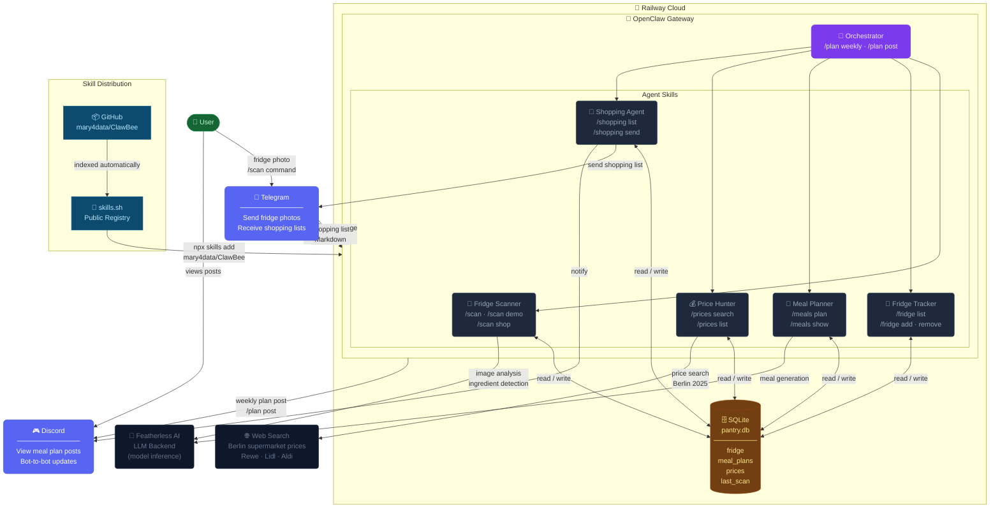

# ClawBee — Family Meal Planner Skills

> AI-powered meal planning for OpenClaw. Photo your fridge, get a weekly plan, receive the shopping list on Telegram.

[](https://skills.sh/mary4data/ClawBee)
[](LICENSE.txt)

## Install

```bash
npx skills add mary4data/ClawBee
```

Or install individual skills:

```bash
npx skills add mary4data/ClawBee@orchestrator      # Full pipeline
npx skills add mary4data/ClawBee@fridge-scanner    # Photo scan
npx skills add mary4data/ClawBee@shopping-agent    # Telegram delivery
```

---

## Architecture



---

## Skills

| Skill | Command | Description |
|---|---|---|
| **orchestrator** | `/plan weekly [budget]` | Full pipeline: fridge → prices → plan → Telegram |
| **fridge-scanner** | `/scan` + photo | Detect ingredients from photo, generate 3-day plan |
| **fridge-tracker** | `/fridge list/add/remove` | Manage pantry inventory |
| **meal-planner** | `/meals plan [budget]` | Weekly 7-day dinner plan |
| **price-hunter** | `/prices search <item>` | Find cheapest prices in Berlin |
| **shopping-agent** | `/shopping send` | Send optimized list to Telegram |

## Quick Start

```
/plan weekly 80          → full pipeline, €80 budget
/scan demo               → demo scan (no photo needed)
/fridge add eggs 12      → add to fridge
/prices search chicken   → find Berlin prices
/shopping send           → push list to Telegram
```

## Stack

- **Runtime**: [OpenClaw](https://openclaw.ai) on Railway
- **LLM**: Featherless AI
- **Channels**: Telegram (shopping lists) + Discord (plan display)
- **Storage**: SQLite (`pantry.db`)
- **Skills**: [skills.sh/mary4data/ClawBee](https://skills.sh/mary4data/ClawBee)

## License

Apache 2.0 — see [LICENSE.txt](LICENSE.txt)
