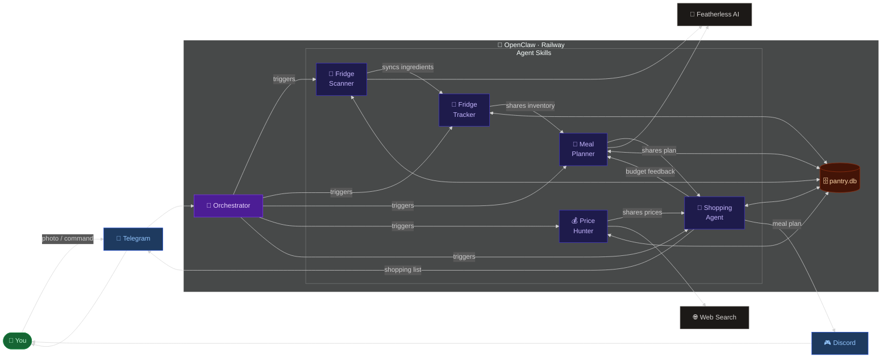
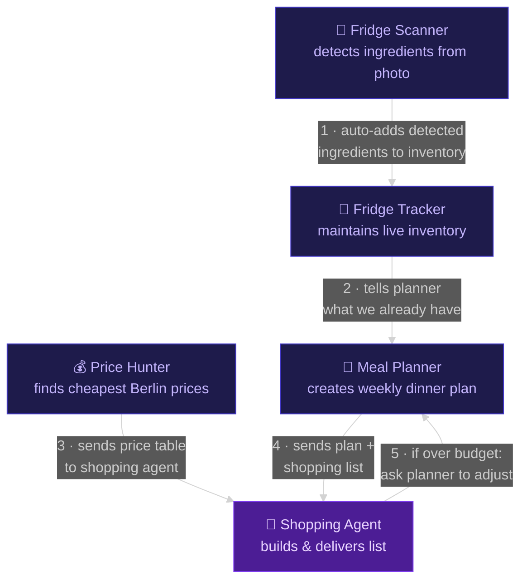
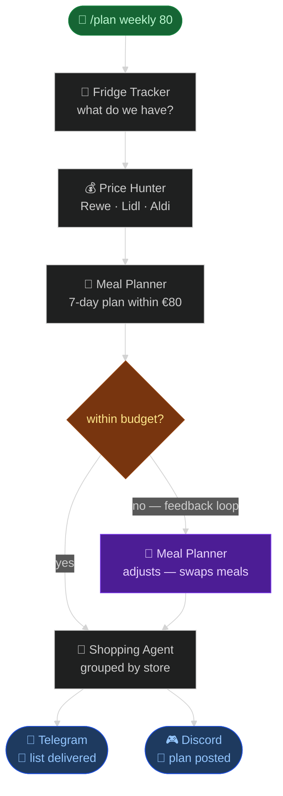
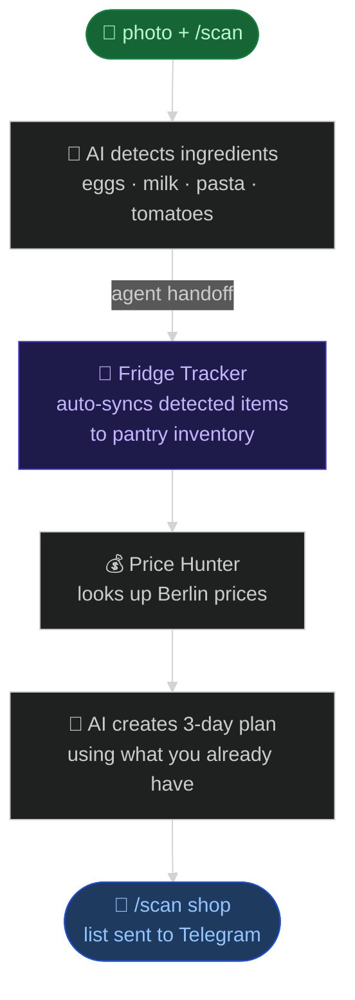

# ClawBee — How It Works

> Photo your fridge → AI agents collaborate → shopping list lands on Telegram.

---

## System Overview

---

## Agent-to-Agent Communication

Agents share results directly — no need to route everything through the orchestrator.

| From | To | What is shared |
|---|---|---|
| Fridge Scanner | Fridge Tracker | Detected ingredients → auto-added to inventory |
| Fridge Tracker | Meal Planner | Current stock → planner skips items already owned |
| Price Hunter | Shopping Agent | Best prices per store → used for cost estimates |
| Meal Planner | Shopping Agent | Weekly plan + missing ingredients list |
| Shopping Agent | Meal Planner | Over-budget signal → planner swaps expensive meals |

---

## Weekly Plan Flow

---

## Fridge Scan Flow

