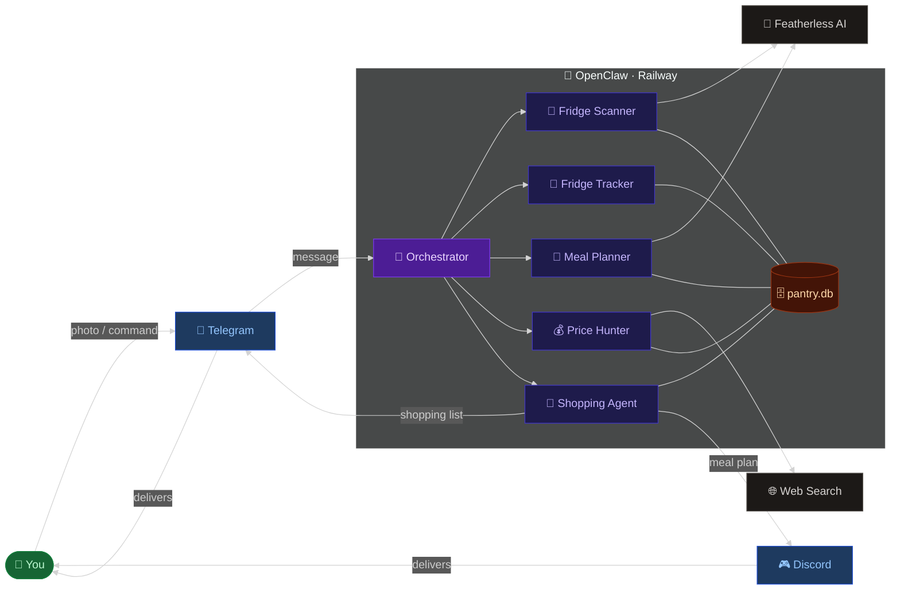
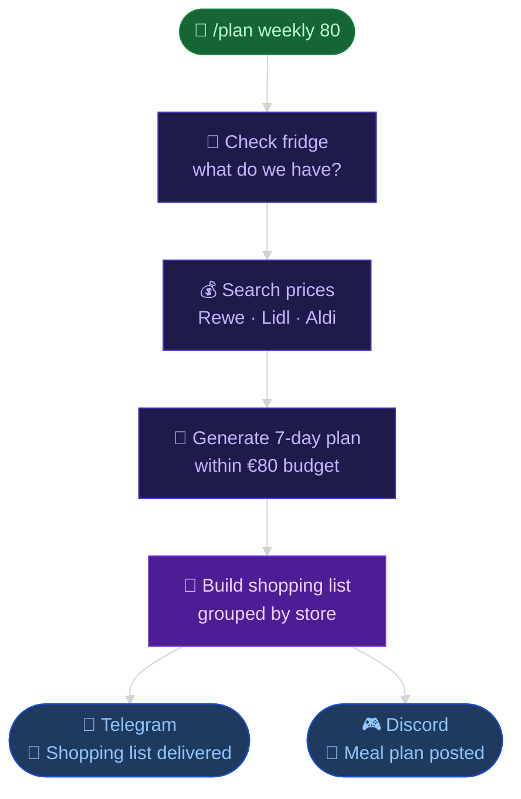
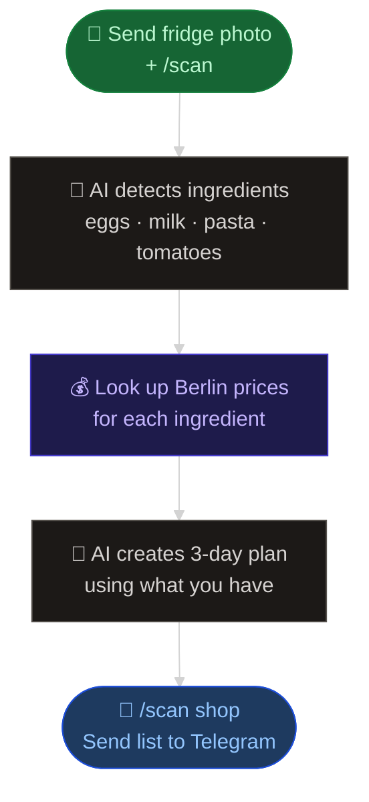

# ClawBee — How It Works

> Photo your fridge → AI plans your week → shopping list lands on Telegram.

---

## System Overview

---

## Weekly Plan Flow

---

## Fridge Scan Flow

---

## Commands

| Command | What it does |
|---|---|
| `/plan weekly 80` | Full pipeline — fridge → prices → plan → Telegram |
| `/scan` + photo | Scan fridge photo → instant 3-day plan |
| `/scan demo` | Try without a photo |
| `/scan shop` | Send plan's shopping list to Telegram |
| `/fridge add eggs 12` | Track what's in your fridge |
| `/prices search chicken` | Find cheapest price in Berlin |
| `/shopping optimize 60` | Check list against budget |
