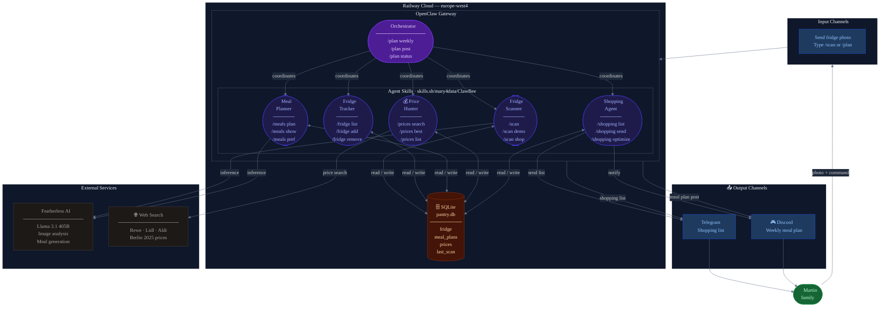
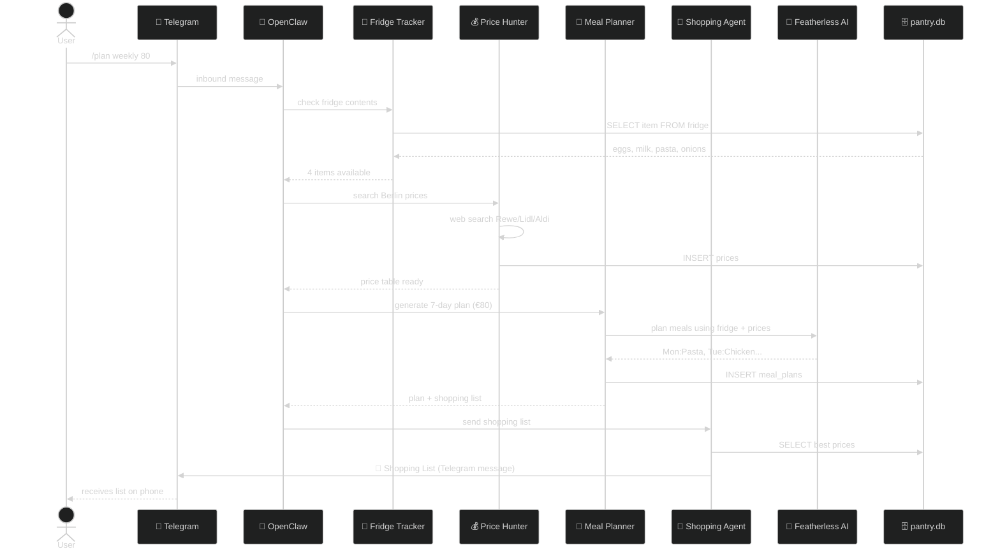
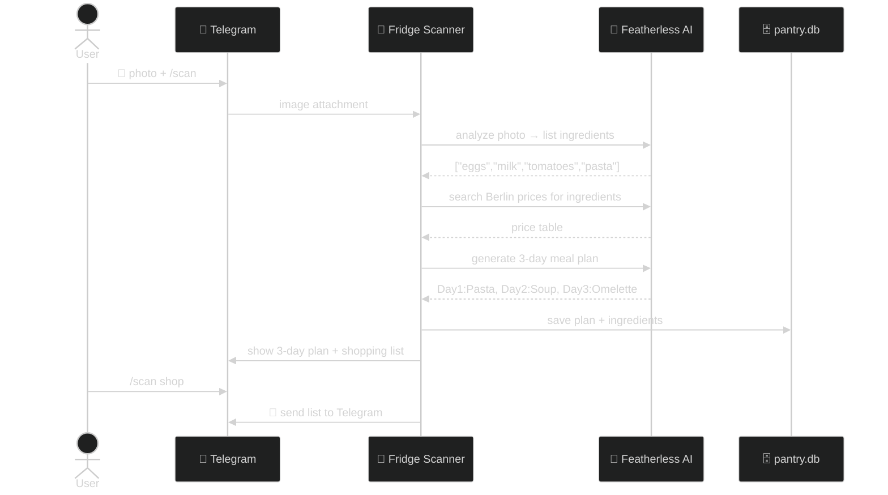

# ClawBee Architecture

> AI-powered family meal planning — photo your fridge, get a plan, receive your shopping list on Telegram.

---

## Full Pipeline: `/plan weekly 80`

---

## Fridge Scan Flow: `/scan` + photo

